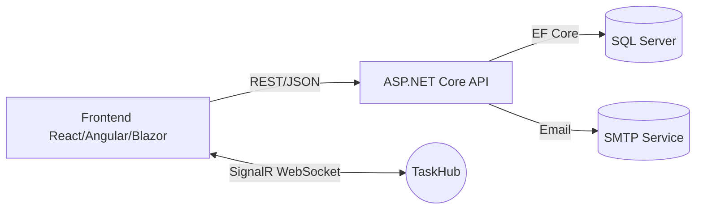

## Task Management App

> Một ứng dụng quản lý nhiệm vụ với API ASP.NET Core, Entity Framework Core (SQL Server), xác thực JWT, SignalR realtime, và sẵn sàng tích hợp React/Angular/Blazor.

### Tính năng nổi bật
- **Authentication**: Đăng ký, đăng nhập, JWT Bearer, phân quyền theo role (User/Admin)
- **Task CRUD**: Tạo, xem danh sách (filter/search/pagination), xem chi tiết, cập nhật, xóa
- **Assignments**: Gán/Bỏ gán người dùng cho nhiệm vụ (multi-user)
- **Notifications**: Đọc danh sách thông báo, đánh dấu đã đọc
- **Realtime**: SignalR cho sự kiện tạo/cập nhật/xóa/assign/unassign
- **Error handling**: Global exception handler trả về `ProblemDetails`
- **Logging**: Serilog console sink, enrich log context
- **Migrations**: EF Core migrations và cập nhật schema
- **Seed**: Tự động seed tài khoản admin nếu chưa có

### Kiến trúc tổng quan


### Công nghệ
- Backend: ASP.NET Core 8, EF Core 9 (SQL Server), JWT Bearer, SignalR, Serilog
- Database: SQL Server
- Frontend: React/Angular/Blazor (tùy chọn, chưa kèm repo UI)

## Cấu trúc thư mục
```
Task-Management-App/
├─ TaskManagementApp/
│  ├─ Controllers/
│  │  ├─ AuthController.cs
│  │  ├─ TasksController.cs
│  │  ├─ TaskAssignmentsController.cs
│  │  ├─ UsersController.cs
│  │  ├─ NotificationsController.cs
│  │  └─ PasswordController.cs
│  ├─ Models/
│  │  ├─ User.cs, Task.cs, TaskAssignment.cs,
│  │  ├─ Notification.cs, RefreshToken.cs, ActivityLog.cs,
│  │  ├─ PasswordResetToken.cs,
│  │  └─ TaskManagementAppContext.cs
│  ├─ RealTime/TaskHub.cs
│  ├─ Services/
│  │  ├─ TokenService.cs, PasswordHasher.cs,
│  │  ├─ EmailService.cs, AdminSeeder.cs
│  ├─ Program.cs
│  ├─ appsettings.json
│  └─ TaskManagementApp.csproj
└─ README.md
```

## Bắt đầu nhanh

### Yêu cầu môi trường
- dotnet SDK 8+
- SQL Server (cục bộ hoặc từ xa)

### Cấu hình
Chỉnh `Task-Management-App/TaskManagementApp/appsettings.json`:

```json
{
  "ConnectionStrings": {
    "DBDefault": "Data Source=YOUR_SQL;Initial Catalog=TaskManagementApp;User ID=sa;Password=***;Trusted_Connection=True;Trust Server Certificate=True"
  },
  "Jwt": {
    "Issuer": "TaskManagementApp",
    "Audience": "TaskManagementAppAudience",
    "Secret": "replace-with-strong-random-secret"
  },
  "Smtp": {
    "Host": "smtp.example.com",
    "Port": 587,
    "User": "no-reply@example.com",
    "Pass": "password",
    "From": "no-reply@example.com"
  }
}
```

### Cài đặt & chạy
```powershell
cd Task-Management-App/TaskManagementApp
dotnet restore
dotnet tool install --global dotnet-ef --version 9.*
dotnet ef migrations add InitialCreate
dotnet ef database update
dotnet run
```

- Swagger (Dev): truy cập `/swagger` để thử API và thêm JWT qua nút Authorize.
- Tài khoản admin mặc định sẽ được seed: `admin@example.com` / `Admin@123`

## API chính

### Auth
- POST api/auth/register
- POST api/auth/login
- GET api/auth/me (JWT)

### Password
- POST api/password/forgot  gửi email reset (trả 200 OK dù email không tồn tại)
- POST api/password/reset   đặt mật khẩu mới bằng token

### Tasks
- GET api/tasks?status=&search=&page=&pageSize=
- GET api/tasks/{id}
- POST api/tasks
- PUT/PATCH api/tasks/{id}
- DELETE api/tasks/{id}

### Assignments
- POST api/tasks/{taskId}/assignments  body: { "userId": "..." }
- DELETE api/tasks/{taskId}/assignments/{userId}

### Users
- GET api/users (yêu cầu role Admin)

### Notifications
- GET api/notifications
- POST api/notifications/{id}/read

## SignalR realtime
Hub: `/hubs/tasks`

#### Client JavaScript (React/Angular)
```javascript
import * as signalR from '@microsoft/signalr';

const connection = new signalR.HubConnectionBuilder()
  .withUrl('/hubs/tasks', {
    accessTokenFactory: () => localStorage.getItem('token') ?? ''
  })
  .withAutomaticReconnect()
  .build();

connection.on('TaskCreated', (task) => { /* update UI */ });
connection.on('TaskUpdated', (task) => { /* update UI */ });
connection.on('TaskDeleted', ({ taskId }) => { /* update UI */ });
connection.on('TaskAssigned', ({ taskId, userId }) => { /* update UI */ });
connection.on('TaskUnassigned', ({ taskId, userId }) => { /* update UI */ });

await connection.start();

// Theo dõi một task cụ thể (nhóm)
await connection.invoke('JoinTaskGroup', 'TASK_ID');
// ... khi rời
await connection.invoke('LeaveTaskGroup', 'TASK_ID');
```

## Gợi ý Frontend
- Lưu token trong localStorage/sessionStorage
- Protected routes kiểm tra JWT
- State management: React (Redux/Context), Angular (NgRx), Blazor (services)
- UI libs: Bootstrap, Material UI, hoặc tương đương

## Bảo mật & sản xuất
- Dùng secret mạnh cho Jwt:Secret và biến môi trường khi triển khai
- Bật HTTPS, cấu hình CORS theo domain UI thực tế
- Hash mật khẩu bằng BCrypt (đã có), hạn chế rò rỉ thông tin khi reset password
- Xem log qua Serilog console; có thể thêm sinks khác nếu cần

## Troubleshooting
- Lỗi kết nối DB: kiểm tra ConnectionStrings:DBDefault và quyền truy cập SQL Server
- Migrations lỗi: cài dotnet-ef, xóa lại migrations và database update
- Swagger không authorize: kiểm tra bạn đã dán token "Bearer <jwt>" đúng định dạng

## Giấy phép
Mã nguồn dùng cho mục đích học tập và demo. Cập nhật giấy phép phù hợp nếu dùng trong sản phẩm.
